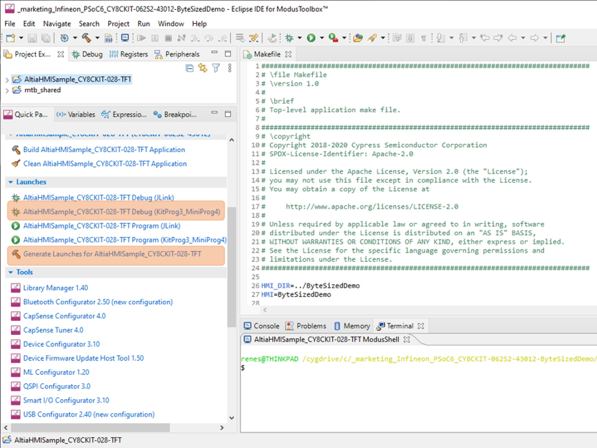

# Altia Multi-Industry Demo for PSoC 6

This readme describes the steps necessary to build Altia Multi-Industry Demo for Infineon PSoC 6 Evaluation Board, CY8CKIT-062S2-43012, utilizing CY8CKIT-028-TFT display.

## Requirements
- [ModusToolbox™ software](https://www.infineon.com/modustoolbox) v3.0.0 or later (sample was tested with v3.0.0)
- Board support package (BSP) minimum required version: v4.1.0 (sample was tested with this version)
- Programming language: C
- Associated parts: All [PSoC™ 6 MCU](https://www.infineon.com/cms/en/product/microcontroller/32-bit-psoc-arm-cortex-microcontroller/psoc-6-32-bit-arm-cortex-m4-mcu) parts

### Supported Languages
- English

### Supported toolchains
- GNU Arm® embedded compiler v10.3.1 (GCC_ARM)

### Supported kits
- PSoC™ 62S2 Wi-Fi Bluetooth® pioneer kit (CY8CKIT-062S2-43012) + Display (CY8CKIT-028-TFT)

## Installation
For this demo, you need to:
1. Download and install ModusToolBox.
2. Request from support@altia.com to obtain Altia GUI design tool software.
3. Use the Altia invitation email to create your account.
4. After creation, download and install the Altia Launcher (available after account creation on our website).

## Demo System
- Board Required: [PSoC™ 6 EVB (CY8CKIT-062S2-43012)](https://www.infineon.com/cms/en/product/evaluation-boards/cy8ckit-062s2-43012)
- Operating System: No OS
- Display: [2.4” TFT 240x320 shield board (CY8CKIT-028-TFT)](https://www.infineon.com/cms/en/product/evaluation-boards/cy8ckit-028-tft)
- Rendering: Software Rendering

## Board Connection Setup
The image below shows the PSoC™ 6 evaluation board with the display shield mounted.

- **A** Micro-USB connector (J6) for debugging and flash programming
- **B** SW4 (USER BTN2)
- **C** SW2 (USER BTN1)
- **D** SW1 (XRES) Reset Button

## Build Altia Multi-Industry Demo via ModusToolBox
Below is the overview of two project components that are needed to build the Altia multi-industry demo via ModuToolbox IDE. Check out these two projects from GitHub and clone them into the local folder. The next sections describe how to build Altia HMI first from Altia Launch and then how to use ModusToolbox IDE to build the demo.

1. The Altia Project for the Infineon PSOC 6 platform.  See section [Build Altia HMI from Altia Launcher](#build-altia-hmi-from-altia-launcher)
2. The ModusToolBox Sample project (this repository)
  1. Built and tested with ModusTooBox v2.4.0
  1. The content of the AltiaHMISample_CY8CKIT-028-TFT folder must be imported as a project into the ModusToolBox IDE. After updating the ModusToolBox Libraries, the demo application can be built and deployed to the PSoC 6 evaluation board.
  1. The ModusToolBox sample project includes a linker-script incorporating the Altia BAM binary files and includes the required Altia DeepScreen miniGL target BSP functions.

## Build Altia HMI from Altia Launcher
1. From Altia Launcher window, click the “Create Project” button from the Project view.
2. Select the Infineon PSoC 6 configuration when creating the project. Make sure that “Include tutorial content” is checked then press the “Next” button:

3. A Save-As Dialog will appear.  Browse to the location of your ModusToolBox Workspace (in this folder also your altia-mtb-example-psoc6-multiindustry is located). Enter the name “ByteSizedDemo” for your new Altia project and press Save (the ByteSizedDemo folder shall be next to your altia-mtb-example-psoc6-multiindustry project forlder).  Your new project will now appear in the Project View.
4. From the Project View, click the “…” button at the top right of the project image icon and select “Generate Target Code” to trigger the code generation:

5. Allow the upload of the project to Altia for code generation:

6. The progress of the code generation can be observed in the Activities View:

7. When the code generation is complete, download the results by clicking the download icon in the Activities View:

8. You will download the results later after setting up ModusToolBox

## Using the code example

Create the project and open it using one of the following:

<details><summary><b>In Eclipse IDE for ModusToolbox&trade; software</b></summary>

1. Click the **New Application** link in the **Quick Panel** (or, use **File** > **New** > **ModusToolbox Application**). This launches the [Project Creator](https://www.cypress.com/ModusToolboxProjectCreator) tool.

2. Pick a kit supported by the code example from the list shown in the **Project Creator - Choose Board Support Package (BSP)** dialog.

   When you select a supported kit, the example is reconfigured automatically to work with the kit. To work with a different supported kit later, use the [Library Manager](https://www.cypress.com/ModusToolboxLibraryManager) to choose the BSP for the supported kit. You can use the Library Manager to select or update the BSP and firmware libraries used in this application. To access the Library Manager, click the link from the **Quick Panel**.

   You can also just start the application creation process again and select a different kit.

   If you want to use the application for a kit not listed here, you may need to update the source files. If the kit does not have the required resources, the application may not work.

3. In the **Project Creator - Select Application** dialog, choose the example by enabling the checkbox.

4. Optionally, change the suggested **New Application Name**.

5. The **Application(s) Root Path** defaults to the Eclipse workspace which is usually the desired location for the application. If you want to store the application in a different location, you can change the *Application(s) Root Path* value. Applications that share libraries should be in the same root path.

6. Click **Create** to complete the application creation process.

For more details, see the [Eclipse IDE for ModusToolbox&trade; software user guide](https://www.cypress.com/MTBEclipseIDEUserGuide) (locally available at *{ModusToolbox&trade; software install directory}/ide_{version}/docs/mt_ide_user_guide.pdf*).

</details>

<details><summary><b>In command-line interface (CLI)</b></summary>

ModusToolbox&trade; software provides the Project Creator as both a GUI tool and a command line tool, "project-creator-cli". The CLI tool can be used to create applications from a CLI terminal or from within batch files or shell scripts. This tool is available in the *{ModusToolbox&trade; software install directory}/tools_{version}/project-creator/* directory.

Use a CLI terminal to invoke the "project-creator-cli" tool. On Windows, use the command line "modus-shell" program provided in the ModusToolbox&trade; software installation instead of a standard Windows command-line application. This shell provides access to all ModusToolbox&trade; software tools. You can access it by typing `modus-shell` in the search box in the Windows menu. In Linux and macOS, you can use any terminal application.

The following table lists the arguments for this tool:

    | Argument          | Description                                                                                                                       | Required/optional |
    | ----------------- | --------------------------------------------------------------------------------------------------------------------------------- | ----------------- |
    | `--board-id`      | Defined in the `<id>` field of the [BSP](https://github.com/cypresssemiconductorco?q=bsp-manifest&type=&language=&sort=) manifest | Required          |
    | `--app-id`        | Defined in the `<id>` field of the [CE](https://github.com/cypresssemiconductorco?q=ce-manifest&type=&language=&sort=) manifest   | Required          |
    | `--target-dir`    | Specify the directory in which the application is to be created if you prefer not to use the default current working directory    | Optional          |
    | `--user-app-name` | Specify the name of the application if you prefer to have a name other than the example's default name                            | Optional          |


The following example will clone the "[altia-mtb-example-psoc6-multiindustry](https://github.com/Altia-Marketing/altia-mtb-example-psoc6-multiindustry)" application with the desired name "altia-mtb-example-psoc6-multiindustry" configured for the *CY8CKIT-062S2-43012* BSP into the specified working directory, *C:/mtb_projects*:

   ```
   project-creator-cli --board-id CY8CKIT-062S2-43012 --app-id altia-mtb-example-psoc6-multiindustry --user-app-name altia-mtb-example-psoc6-multiindustry --target-dir "C:/mtb_projects"
   ```

**Note:** The project-creator-cli tool uses the `git clone` and `make getlibs` commands to fetch the repository and import the required libraries. For more details, see the "Project creator tools" section of the [ModusToolbox&trade; software user guide](https://www.cypress.com/ModusToolboxUserGuide) (locally available at *{ModusToolbox&trade; software install directory}/docs_{version}/mtb_user_guide.pdf*).

</details>

<details><summary><b>In third-party IDEs</b></summary>

Use one of the following options:

- **Use the standalone [Project Creator](https://www.cypress.com/ModusToolboxProjectCreator) tool:**

   1. Launch Project Creator from the Windows Start menu or from *{ModusToolbox&trade; software install directory}/tools_{version}/project-creator/project-creator.exe*.

   2. In the initial **Choose Board Support Package** screen, select the BSP and click **Next**.

   3. In the **Select Application** screen, select the appropriate IDE from the **Target IDE** drop-down menu.

   4. Click **Create** and follow the instructions printed in the bottom pane to import or open the exported project in the respective IDE.

- **Use command-line interface (CLI):**

   1. Follow the instructions from the **In command-line interface (CLI)** section to create the application, and import the libraries using the `make getlibs` command.

   2. Export the application to a supported IDE using the `make <ide>` command.

   3. Follow the instructions displayed in the terminal to create or import the application as an IDE project.

For a list of supported IDEs and more details, see the "Exporting to IDEs" section of the [ModusToolbox&trade; software user guide](https://www.cypress.com/ModusToolboxUserGuide) (locally available at *{ModusToolbox&trade; software install directory}/docs_{version}/mtb_user_guide.pdf*).

</details>

## Step-by-step instructions to build the project

1. Create a folder named “ByteSizedDemo” next to the project root folder that you just created.
2. Return to the Altia Launcher > Activities Tab. Select the download button for the design you build in the previous section. A Save-As Dialog will appear.  Pick the ByteSizedDemo folder you just created for the download.
3. A File Explorer window will open after the download is complete.  The following folders will be present:
  1. “log” folder – contains the logs from the code generation.
  1. “out” folder – contains the build artifacts (Altia libs, headers, and reflash assets).
4. Now in ModusToolBox, build the demo application by right-clicking the altia-mtb-example-psoc6-multiindustry project and selecting “Build Project”. Alternatively, this building project process can be done by running “make getlibs” in the ModusToolBox Console.
5. When the application build process is finished successfully, the ELF-file of the application named altia-mtb-example-psoc6-multiindustry.elf will be in altia-mtb-example-psoc6-multiindustry/build/CY8CKIT-062S2-43012/(Debug|Release) folder. 

## Deploy Demo to PSoC 6 Evaluation Board via IDE
The demo executable can be programmed to PSoC 6 evaluation board via the ModusToolbox IDE using the corresponding Application Launcher. It is recommended to update the Launcher Configurations to match the current selected build-type (Debug/Release). This is done by running “Generate Launches for AltiaHIMSample_CY8CKIT-028-TFT” as shown below.
1. Connect the boards J6 USB port to the PC. USB port shown in the Board Connection Setup section of this document.

2. Select “altia-mtb-example-psoc6-multiindustry Program (KitProg3_MiniProg4)” from the Quick Panel to deploy the demo to the board.