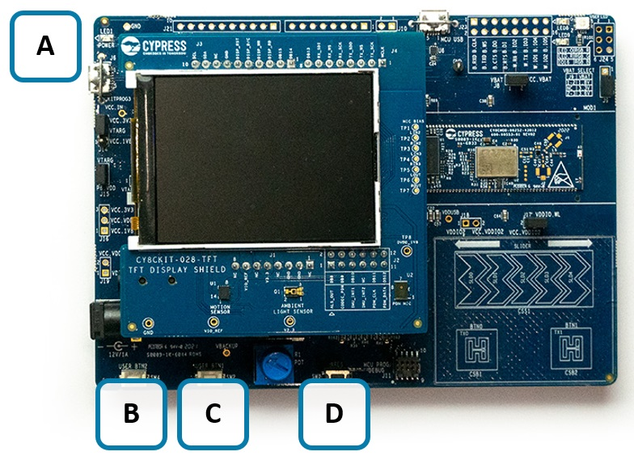
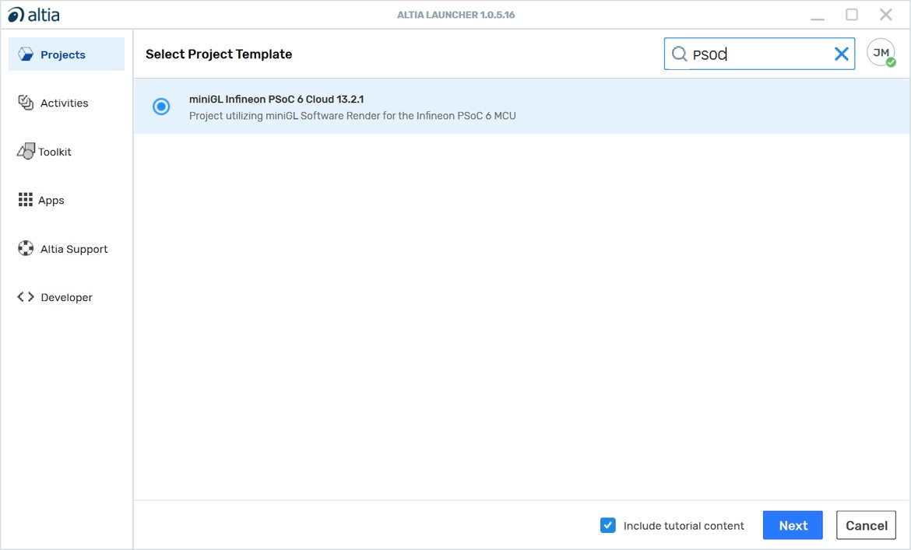
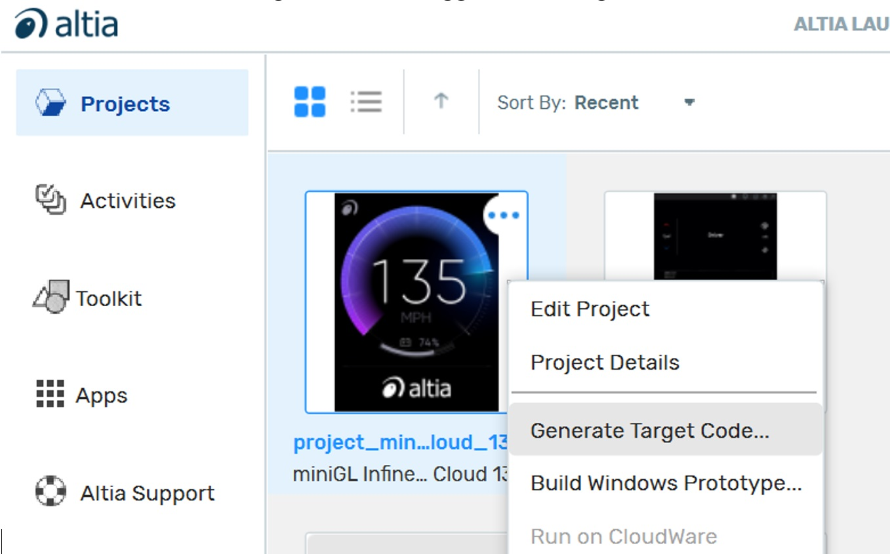
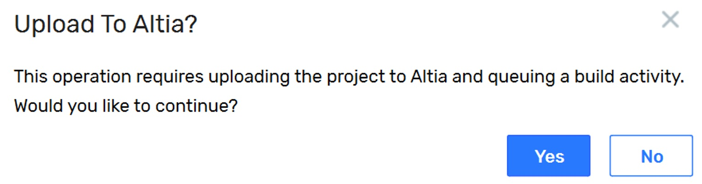
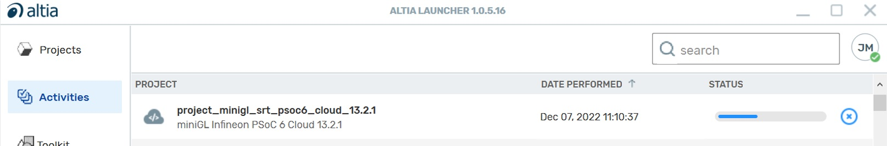

# Altia Multi-Industry Demo for PSoC&trade; 6

This readme describes the steps necessary to build Altia Multi-Industry Demo for Infineon PSoC&trade; 6 Evaluation Board, CY8CKIT-062S2-43012, utilizing CY8CKIT-028-TFT display.

## Requirements
- [ModusToolbox™ software](https://www.infineon.com/modustoolbox) v3.0.0 or later (tested with v3.0.0)
- Board support package (BSP) minimum required version: v4.0.0
- Programming language: C
- Associated parts: All [PSoC™ 6 MCU](https://www.infineon.com/cms/en/product/microcontroller/32-bit-psoc-arm-cortex-microcontroller/psoc-6-32-bit-arm-cortex-m4-mcu) parts

## Supported Languages
- English

## Supported toolchains
- GNU Arm® embedded compiler v10.3.1 (GCC_ARM)

## Supported kits
- PSoC™ 62S2 Wi-Fi Bluetooth® pioneer kit (CY8CKIT-062S2-43012) + Display (CY8CKIT-028-TFT)

## Installation
For this demo, you need to:
1. Download and install ModusToolBox&trade;.
2. Request from support@altia.com to obtain Altia GUI design tool software.
3. Use the Altia invitation email to create your account.
4. After creation, download and install the Altia Launcher (available after account creation on our website).

## Demo System
- Board Required: [PSoC™ 6 EVB (CY8CKIT-062S2-43012)](https://www.infineon.com/cms/en/product/evaluation-boards/cy8ckit-062s2-43012)
- Operating System: No OS
- Display: [2.4” TFT 240x320 shield board (CY8CKIT-028-TFT)](https://www.infineon.com/cms/en/product/evaluation-boards/cy8ckit-028-tft)
- Rendering: Software Rendering

## Board Connection Setup
The image below shows the PSoC™ 6 evaluation board with the display shield mounted.

- **A** Micro-USB connector (J6) for debugging and flash programming
- **B** SW4 (USER BTN2)
- **C** SW2 (USER BTN1)
- **D** SW1 (XRES) Reset Button

## Using the code example

Create the project and open it using one of the following:

<details><summary><b>In Eclipse IDE for ModusToolbox&trade; software</b></summary>

1. Click the **New Application** link in the **Quick Panel** (or, use **File** > **New** > **ModusToolbox Application**). This launches the [Project Creator](https://www.cypress.com/ModusToolboxProjectCreator) tool.

2. Pick a kit supported by the code example from the list shown in the **Project Creator - Choose Board Support Package (BSP)** dialog.

   When you select a supported kit, the example is reconfigured automatically to work with the kit. To work with a different supported kit later, use the [Library Manager](https://www.cypress.com/ModusToolboxLibraryManager) to choose the BSP for the supported kit. You can use the Library Manager to select or update the BSP and firmware libraries used in this application. To access the Library Manager, click the link from the **Quick Panel**.

   You can also just start the application creation process again and select a different kit.

   If you want to use the application for a kit not listed here, you may need to update the source files. If the kit does not have the required resources, the application may not work.

3. In the **Project Creator - Select Application** dialog, choose the example by enabling the checkbox.

4. Optionally, change the suggested **New Application Name**.

5. The **Application(s) Root Path** defaults to the Eclipse workspace which is usually the desired location for the application. If you want to store the application in a different location, you can change the *Application(s) Root Path* value. Applications that share libraries should be in the same root path.

6. Click **Create** to complete the application creation process.

For more details, see the [Eclipse IDE for ModusToolbox&trade; software user guide](https://www.cypress.com/MTBEclipseIDEUserGuide) (locally available at *{ModusToolbox&trade; software install directory}/ide_{version}/docs/mt_ide_user_guide.pdf*).

</details>

<details><summary><b>In command-line interface (CLI)</b></summary>

ModusToolbox&trade; software provides the Project Creator as both a GUI tool and a command line tool, "project-creator-cli". The CLI tool can be used to create applications from a CLI terminal or from within batch files or shell scripts. This tool is available in the *{ModusToolbox&trade; software install directory}/tools_{version}/project-creator/* directory.

Use a CLI terminal to invoke the "project-creator-cli" tool. On Windows, use the command line "modus-shell" program provided in the ModusToolbox&trade; software installation instead of a standard Windows command-line application. This shell provides access to all ModusToolbox&trade; software tools. You can access it by typing `modus-shell` in the search box in the Windows menu. In Linux and macOS, you can use any terminal application.

The following table lists the arguments for this tool:

    | Argument          | Description                                                                                                                       | Required/optional |
    | ----------------- | --------------------------------------------------------------------------------------------------------------------------------- | ----------------- |
    | `--board-id`      | Defined in the `<id>` field of the [BSP](https://github.com/cypresssemiconductorco?q=bsp-manifest&type=&language=&sort=) manifest | Required          |
    | `--app-id`        | Defined in the `<id>` field of the [CE](https://github.com/cypresssemiconductorco?q=ce-manifest&type=&language=&sort=) manifest   | Required          |
    | `--target-dir`    | Specify the directory in which the application is to be created if you prefer not to use the default current working directory    | Optional          |
    | `--user-app-name` | Specify the name of the application if you prefer to have a name other than the example's default name                            | Optional          |


The following example will clone the "[altia-mtb-example-psoc6-multiindustry](https://github.com/Altia-Marketing/altia-mtb-example-psoc6-multiindustry)" application with the desired name "altia-mtb-example-psoc6-multiindustry" configured for the *CY8CKIT-062S2-43012* BSP into the specified working directory, *C:/mtb_projects*:

   ```
   project-creator-cli --board-id CY8CKIT-062S2-43012 --app-id altia-mtb-example-psoc6-multiindustry --user-app-name altia-mtb-example-psoc6-multiindustry --target-dir "C:/mtb_projects"
   ```

**Note:** The project-creator-cli tool uses the `git clone` and `make getlibs` commands to fetch the repository and import the required libraries. For more details, see the "Project creator tools" section of the [ModusToolbox&trade; software user guide](https://www.cypress.com/ModusToolboxUserGuide) (locally available at *{ModusToolbox&trade; software install directory}/docs_{version}/mtb_user_guide.pdf*).

</details>

<details><summary><b>In third-party IDEs</b></summary>

Use one of the following options:

- **Use the standalone [Project Creator](https://www.cypress.com/ModusToolboxProjectCreator) tool:**

   1. Launch Project Creator from the Windows Start menu or from *{ModusToolbox&trade; software install directory}/tools_{version}/project-creator/project-creator.exe*.

   2. In the initial **Choose Board Support Package** screen, select the BSP and click **Next**.

   3. In the **Select Application** screen, select the appropriate IDE from the **Target IDE** drop-down menu.

   4. Click **Create** and follow the instructions printed in the bottom pane to import or open the exported project in the respective IDE.

- **Use command-line interface (CLI):**

   1. Follow the instructions from the **In command-line interface (CLI)** section to create the application, and import the libraries using the `make getlibs` command.

   2. Export the application to a supported IDE using the `make <ide>` command.

   3. Follow the instructions displayed in the terminal to create or import the application as an IDE project.

For a list of supported IDEs and more details, see the "Exporting to IDEs" section of the [ModusToolbox&trade; software user guide](https://www.cypress.com/ModusToolboxUserGuide) (locally available at *{ModusToolbox&trade; software install directory}/docs_{version}/mtb_user_guide.pdf*).

</details>

## Step-by-step instructions to build the application

1. Open Altia Launcher by entering the credentials and logging into your account.

2. From Altia Launcher window, click the **Create Project** button from the Project view.

3. Select the "miniGL Infineon PSoC&trade; 6" configuration when creating the project. Make sure that “Include tutorial content” is checked then press the “Next” button:


4. A **Save-As** dialog will appear. Browse to the location where you want to save the Altia project and enter the name “ByteSizedDemo”. Press **Save**. Your new project will now appear in the Project View in Altia Launcher. 

5. From the Project View, click the “…” button at the top right of the project image icon and select “Generate Target Code” to trigger the code generation:


6. Allow the upload of the project to Altia for code generation:


7. The progress of the code generation can be observed in the Activities View:


8. When the code generation is complete, you should see the option to download the results in the Activities View. We will use this in the upcoming steps.


9. Create a folder named "ByteSizedDemo" inside the application root folder. 

10. In Altia Launcher, navigate to the Activities tab. Click the download button for the design you built in the previous steps. A **Save-As** dialog will appear. Pick the "ByteSizedDemo" folder you just created for the download.

11. The file explorer window will open after the download is complete. The following folders will be present:
   - “log” folder – contains the logs from the code generation.
   - “out” folder – contains the build artifacts (Altia libs, headers, and reflash assets).

12. In Eclipse IDE, build the demo application by right-clicking the altia-mtb-example-psoc6-multiindustry project and selecting “Build Application”. Alternatively, the application can be built using the "make build" command using any shell application on Linux/MacOS or "modus-shell" application on Windows.

13. When the application is built successfully, the elf file of the application named altia-mtb-example-psoc6-multiindustry.elf will be generated in altia-mtb-example-psoc6-multiindustry/build/APP_CY8CKIT-062S2-43012/(Debug|Release) folder.

## Operation

1. Connect the board to your PC using the provided USB cable through the KitProg3 USB connector.

2. Program the board using one of the following:

   <details><summary><b>Using Eclipse IDE for ModusToolbox&trade; software</b></summary>

      1. Select the application project in the Project Explorer.

      2. Update the Launches to use the right configuration (Debug/Release) by clicking "Generate Launches" inside the **Launches** section in the Quick Panel.

      3. In the **Quick Panel**, scroll down, and click **\<Application Name> Program (KitProg3_MiniProg4)**.
   </details>

   <details><summary><b>Using CLI</b></summary>

     From the terminal, execute the `make program` command to build and program the application using the default toolchain to the default target. The default toolchain is specified in the application's Makefile but you can override this value manually:
      ```
      make program TOOLCHAIN=<toolchain>
      ```

      Example:
      ```
      make program TOOLCHAIN=GCC_ARM
      ```
   </details>

4. After programming, the application starts automatically. 

5. Observe the TFT display transitions between different screens that showcase Altia GUI designs you can create for different industries.

## Debugging

You can debug the example to step through the code. In the IDE, use the **\<Application Name> Debug (KitProg3_MiniProg4)** configuration in the **Quick Panel**. For details, see the "Program and debug" section in the [Eclipse IDE for ModusToolbox&trade; software user guide](https://www.infineon.com/MTBEclipseIDEUserGuide).

**Note:** **(Only while debugging)** On the CM4 CPU, some code in `main()` may execute before the debugger halts at the beginning of `main()`. This means that some code executes twice – once before the debugger stops execution, and again after the debugger resets the program counter to the beginning of `main()`. See [KBA231071](https://community.infineon.com/docs/DOC-21143) to learn about this and for the workaround.

## Customizing the code example

To incorporate the Altia library into a ModusToolbox&trade; application here are the steps:

1. Create your project in Altia Launcher. 

2. Refer to the User Guides available in the menu to create your own GUI. Contact Altia support for any queries on using the tool.

3. Create a folder in your application root folder and have Altia launcher download the generated files into this folder. This is similar to the [steps](#step-by-step-instructions-to-build-the-application) followed when building the code example.

4. Create a prebuild command to generate relocatable object files and binaries that will be used for partial linking. Repeat this command for all other object files as needed. Here `HMI_DIR` is a user defined variable to point to the folder created in the previous step that contains the generated files. See [Makefile](./Makefile) for more information.
   ```
   PREBUILD+=$(CY_TOOLS_PATHS)/gcc/bin/arm-none-eabi-ld.exe -r -b binary $(HMI_DIR)/out/reflash/$(HMI)/altia_table_bin.o $(HMI_DIR)/out/reflash/$(HMI)/table.bin;
   ```

5. Integrate the necessary generated binary files and Altia library using the `LDFLAGS` and `LDLIBS` makefile variables. See [Makefile](./Makefile) for more information.
   ```
   LDFLAGS=$(HMI_DIR)/out/reflash/$(HMI)/altia_table_bin.o 
   LDLIBS=$(HMI_DIR)/out/libaltia.a
   ```

6. Include necessary folders using the `INCLUDES` makefile variable. See [Makefile](./Makefile) for more information.

7. Modify the linker script available inside the bsps folder to add a `.rodata` section to contain the images, fonts and any other constant data required by the GUI. Allocate a region of flash for `altia_flash` section and then add the lines below. See [template linker script](./templates/TARGET_CY8CKIT-062S2-43012/COMPONENT_CM4/TOOLCHAIN_GCC_ARM/linker.ld) for more information.
   ```
      .rodata ORIGIN(altia_flash) :
      {
         /* Read-only code (constants). */
         __altia_table_start__ = .;
         KEEP(*altia_table_bin.o(.data))
         __altia_table_end__ = .;
         __altia_images_start__ = .;
         KEEP(*altia_images_bin.o(.data))
         __altia_images_end__ = .;
         __altia_fonts_start__ = .;
         KEEP(*altia_fonts_bin.o(.data))        
         __altia_fonts_end__ = .;
      } > altia_flash
   ```

8. Set the `VFP_SELECT` variable to support hardware floating point.
   ```
   VFP_SELECT=hardfp
   ```

9. Modify the source code to use Altia APIs and develop your application.